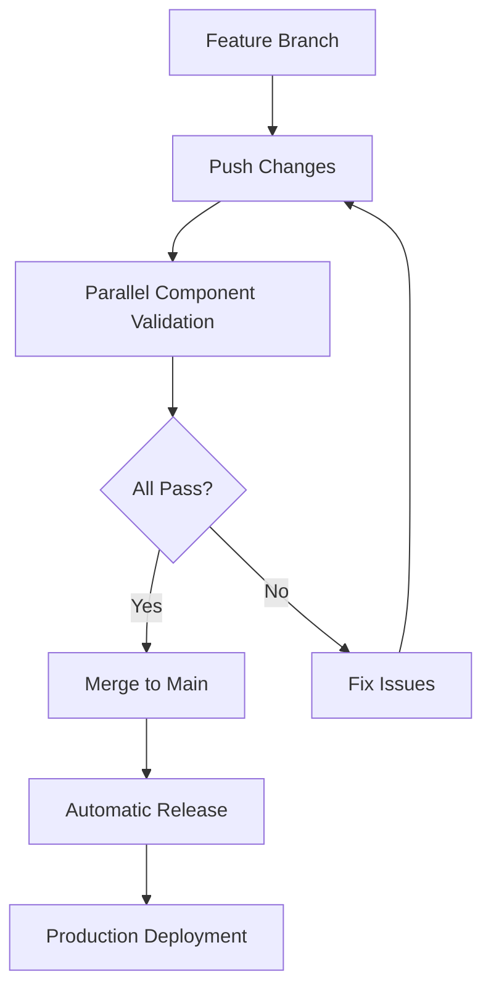

# GitHub Workflows - Trunk-Based Development

## Philosophy: Trunk-Based Development with Local First Validation

This project uses **trunk-based development** with a **"Local First"** approach to ensure fast feedback and maintain a production-ready main branch.

## Responsibility Separation

### 🏠 Local Git Hooks (Fast Feedback - 30-60s)

**Pre-commit** - Fast validation before each commit:
- ✅ Linting (ESLint) 
- ✅ Type checking (TypeScript, Svelte)
- ✅ Unit tests (Jest + Vitest)
- ✅ High severity security audit

**Pre-push** - Comprehensive testing before push (2-3 min):
- ✅ Full build compilation
- ✅ Test coverage reports
- ✅ Dependency health check
- ✅ Docker integration tests (if available)
- ✅ Final security validation

### 🚀 GitHub Actions CI (Deployment Focus - 5-10 min)

**parallel-build.yml** - Comprehensive parallel component validation:
- ✅ Frontend (SvelteKit) - build, lint, test, type-check
- ✅ GraphQL Server (Node.js) - build, lint, test, type-check  
- ✅ Mobile App (Flutter) - build, analyze, test
- ✅ Database (MongoDB + Neo4j) - schema validation
- ✅ Integration Tests - API connectivity verification
- ✅ Docker Build Validation - image creation
- ✅ Release Gate - all components must pass

**ci.yml** - Production deployment pipeline:
- ✅ Application builds for deployment
- ✅ Docker image creation and registry push
- ✅ Container security scanning (Trivy)
- ✅ CodeQL static analysis (main branch)

**release.yml** - Automated semantic releases:
- ✅ Triggered by successful parallel validation
- ✅ Semantic versioning and changelog generation
- ✅ Automated release publishing

### 🤖 Automated Maintenance

**update-dependencies.yml** - Automated dependency management:
- ✅ Weekly dependency updates (main branch only)
- ✅ Automated PR creation with changelogs

## Removed Workflows

These workflows were **removed** to eliminate redundancy:

- ❌ `dependency-review.yml` - Security audit covered by git hooks
- ❌ `docker-ci.yml` - Docker building merged into main CI
- ❌ `build.yml` - Build testing covered by git hooks  
- ❌ `coverage.yml` - Coverage reports covered by git hooks
- ❌ `deploy.yml` - Deployment merged into main CI
- ❌ `docker-deploy.yml` - Deployment merged into main CI

## Benefits

1. **Faster Feedback** - Issues caught in 30-60s locally vs 5-10 min in CI
2. **Reduced CI Costs** - CI only runs deployment-specific tasks
3. **Simpler Pipeline Management** - 2 workflows instead of 8
4. **Better Developer Experience** - Know issues before pushing
5. **Reliable Deployments** - Comprehensive validation before any push

## Trunk-Based Development Branch Strategy

### ✅ **Single Source of Truth**
- **main**: Production-ready code, always deployable
- **feature/***: Short-lived branches (< 1 day) for specific features
- **hotfix/***: Critical production fixes (merge directly to main)
- No long-lived `dev`, `staging`, or integration branches

### Workflow Triggers

- **Pre-commit**: Every commit (local validation)
- **Pre-push**: Every push attempt (comprehensive testing)
- **CI**: Pull requests and pushes to **main only**
- **Release**: Automated on successful main branch validation
- **Updates**: Weekly dependency updates on main branch

## Trunk-Based Development Workflow

```bash
# 1. Create short-lived feature branch
git checkout -b feature/add-premier-league

# 2. Make small, focused changes
git add .
# → Pre-commit runs (30-60s) - lint, types, tests, security

git commit -m "feat: add Premier League standings API"

# 3. Push early and often (same day)
git push origin feature/add-premier-league
# → Pre-push runs (2-3m) - build, coverage, integration tests
# → Parallel validation runs (5-10m) - all components validated

# 4. Create PR and merge quickly (< 1 day)
# → All components pass validation
# → Merge to main
# → Automatic release triggered
```

## Integration Flow



This approach ensures quality at every step while minimizing redundant work and CI pipeline complexity.